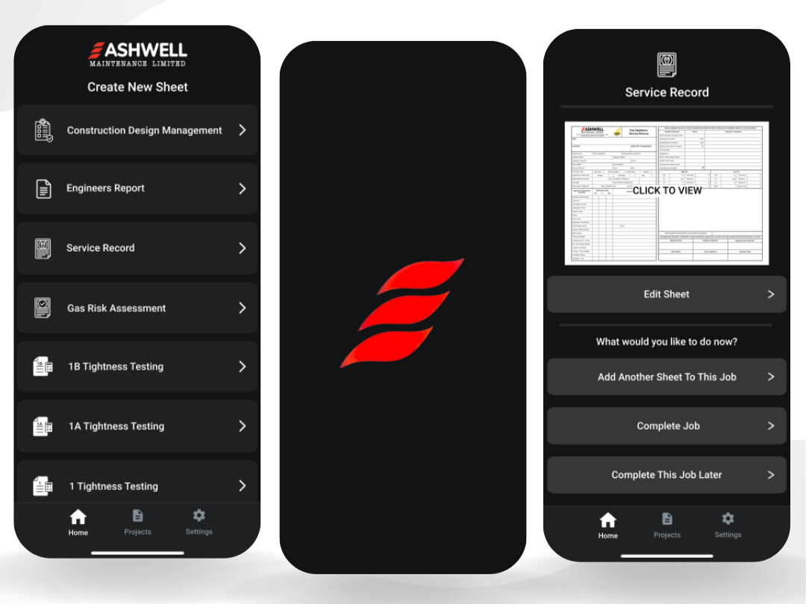
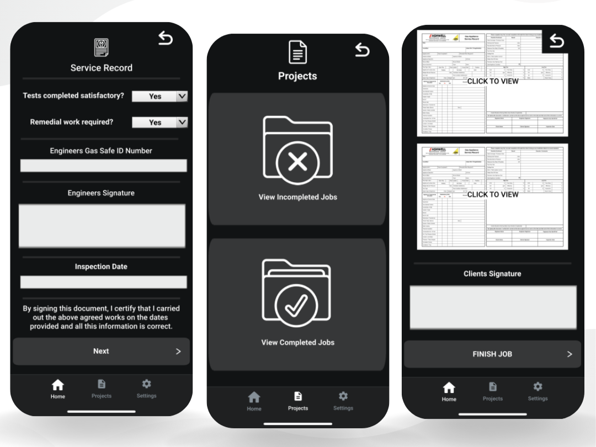

# Ashwell Maintenance App 🛠️

The Ashwell Maintenance app is a powerful tool designed to simplify PDF generation through form filling. This application was tailor-made for UK company Ashwell Maintenance to optimize workflow and enhance document management as a part of a Fiverr project. 📄

This is one of my most complex Fiverr projects to date. It was developed using .NET MAUI, it streamlines PDF generation through dynamic forms, automatic signing of documents, PDF generation, offline capabilities, Dropbox integration and more.

## Purpose 🌟

The Ashwell Maintenance app serves as a comprehensive solution for:

- 📝 Seamless PDF Generation: Effortlessly create multiple different PDF documents just by filling out forms.
- 📂 Efficient Organization: Sort generated PDFs into specialized folders, categorized by job.
- 📲 Cross-Platform Accessibility: Designed primarily for both iOS and Android supporting tablets and iPads.
- 🔄 Smart Synchronization: Stay productive offline, syncing data when you have a network connection.
- ✍️ Streamlined Signatures: Easily collect signatures in the app from engineers and clients.
- 📑 Edit and Rename: You can easily rename, update and edit projects that are completed, as it is all saved in the cloud.
- 🚀 Automated Finalization: Documents in a job folder are automatically marked as complete once they are signed. Sign once, and the signature will appear automatically on every PDF document in the Folder.
- 🔖 Automatic Signing: Even after the project is completed and signed, adding more documents to it will sign and upload them automatically without needing intervention from personel, as signatures are saved in the cloud.
- ☁️ Dropbox Integration: When signed, the app will conveniently upload signed and filled PDF files to Dropbox for easy access and backup for the owner only.
- 📦 Powered by .NET MAUI: A responsive and reliable user experience, built on .NET MAUI.

## Offline Capability 🌐

The Ashwell Maintenance app is designed to operate effectively both online and offline. When offline, you can continue to work on your documents, and once a network connection is restored, the app seamlessly syncs your data with the servers. This offline functionality ensures that you can be productive no matter where you are.

## Tech Stack 💻

The Ashwell Maintenance app leverages the following technologies:

- **Platform**: .NET MAUI
- **Frontend**: XAML
- **Back-end**: PHP
- **Database**: MySQL
- **Cloud Integration**: Dropbox API

## License 📜

This project is licensed under the MIT License. See the [LICENSE](LICENSE) file for details.

---

**Note:** This was created as a Fiverr project for the company.
